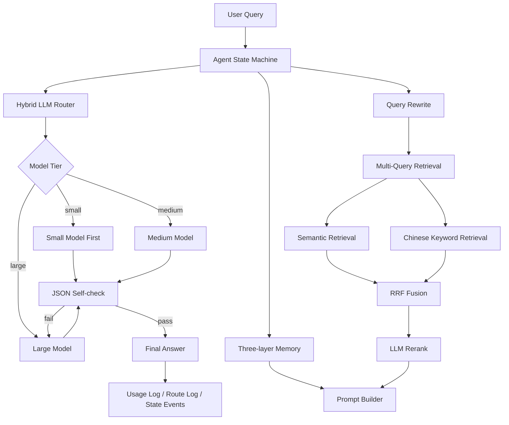

# RAG-Memory-Agent

[](#)
[](#)
[](#)
[](#)
[](#)
[](#)

**Enterprise RAG + Memory Agent with LLM routing, cascade fallback, RAGAS evaluation, and agent state-machine observability.**

[中文文档](README.zh-CN.md) · [Evaluation Report](outputs/routing_benchmark_report.md)

## Why This Project

Most RAG demos stop at “upload documents and ask questions”. This project focuses on what a production-grade enterprise RAG agent actually needs:

- reliable retrieval over long enterprise documents
- multi-turn memory and user preference tracking
- model routing to reduce LLM cost and latency
- cascade fallback from small models to stronger models
- structured outputs to avoid parsing drift
- explicit agent state machine for observability
- reproducible RAGAS and LLM-as-Judge benchmarks

## Highlights

- **Enterprise RAG**: upload, parse, title-aware chunking, embedding, hybrid retrieval, RRF fusion, LLM reranking, grounded generation
- **Three-layer Memory**: short-term session memory, long-term vector memory, user preference extraction
- **LLM Router**: rule routing + small-model difficulty scoring for `small / medium / large` model tiers
- **Cascade Fallback**: small model answers first; self-check failures trigger stronger model regeneration
- **Agent State Machine**: records `route / retrieve / generate / validate / persist / done` stages for every request
- **Structured Outputs**: JSON-constrained routing score and answer self-check to improve parsing stability
- **Evaluation Suite**: RAGAS, LLM-as-Judge, cost/latency benchmark, state-machine stability benchmark

## Quantified Results

### RAG Quality

Evaluated on a 100k-character enterprise policy knowledge base with 184 optimized chunks and 30 QA samples.

| Metric | Score |
|---|---:|
| Context Precision | 0.8072 |
| Context Recall | 0.9000 |
| Faithfulness | 0.8534 |
| Answer Relevancy | 0.8567 |
| Answer Correctness | 0.8867 |

Retrieval optimization improvement:

| Metric | Before | After | Improvement |
|---|---:|---:|---:|
| Context Precision | 0.7500 | 0.8072 | +7.63% |
| Context Recall | 0.7833 | 0.9000 | +14.89% |

### Cost and Latency

Baseline uses `qwen-max` for every request. Optimized mode uses model routing and cascade fallback.

| Metric | Baseline | Optimized | Improvement |
|---|---:|---:|---:|
| Estimated cost | 0.007257 | 0.0007871 | -89.15% |
| Average latency | 21620.69 ms | 6454.71 ms | -70.15% |
| P95 latency | 41866.45 ms | 18294.86 ms | -56.30% |

### Agent Stability

Evaluated on 50 mixed samples covering chat, normal QA, sensitive questions, fuzzy questions, multi-context questions, unknown-answer questions, and context-reference questions.

| Metric | Score |
|---|---:|
| Request success rate | 100.00% |
| State-chain completeness | 100.00% |
| Router JSON parse success | 100.00% |
| Self-check JSON parse success | 100.00% |

## Architecture



## Quick Start

Prepare `.env` from `.env.example` first.

```bash
cp .env.example .env
docker compose up -d --build
```

Open:

```text
http://localhost:8000/
```

## API

- `GET /` - Web UI
- `POST /api/chat` - Chat endpoint
- `GET /api/models?provider=...` - List models
- `POST /api/upload` - Upload and index documents

Example:

```bash
curl -s http://localhost:8000/api/chat \
  -H "Content-Type: application/json" \
  -d '{"user_id":"u1","session_id":"s1","message":"What should I do if an approval is rejected?"}'
```

## Model Routing Configuration

Example for DashScope / Qwen:

```env
LLM_PROVIDER=dashscope
LLM_SMALL_MODEL=qwen-turbo
LLM_MEDIUM_MODEL=qwen-plus
LLM_LARGE_MODEL=qwen-max
```

If `llm_model` is not provided in `/api/chat`, routing and cascade fallback are enabled automatically. If `llm_model` is provided, the request bypasses routing for debugging.

## Reproduce Benchmarks

### RAGAS Retrieval Evaluation

```bash
docker compose exec -T app python scripts/ragas_eval.py \
  --input data/ragas_enterprise_kb_testset.csv \
  --metric-set retrieval \
  --output outputs/ragas_enterprise_retrieval_results_optimized.csv
```

### LLM-as-Judge Answer Evaluation

```bash
docker compose exec -T app python scripts/llm_judge_eval.py \
  --input outputs/ragas_enterprise_faithfulness_collected.csv \
  --output outputs/llm_judge_answer_metrics.csv
```

### Routing Cost and Latency Benchmark

```bash
docker compose exec -T app python scripts/benchmark_routing.py \
  --input data/ragas_employee_handbook_testset.csv
```

### Agent State Machine Benchmark

```bash
docker compose exec -T app python scripts/benchmark_agent_state.py \
  --input data/agent_state_benchmark_questions.csv
```

## Repository Map

```text
services/chat_service.py          # Main chat pipeline
services/router_service.py        # Hybrid router and structured self-check
services/agent_state.py           # Agent state machine
modules/rag/loader.py             # Title-aware chunking
modules/rag/retriever.py          # Hybrid retrieval, RRF fusion, reranking
scripts/ragas_eval.py             # RAGAS evaluation
scripts/llm_judge_eval.py         # LLM-as-Judge answer metrics
scripts/benchmark_routing.py      # Cost and latency benchmark
scripts/benchmark_agent_state.py  # State-machine stability benchmark
outputs/routing_benchmark_report.md
```

## Suggested GitHub Topics

`rag` · `ragas` · `llm` · `ai-agent` · `memory` · `fastapi` · `langchain` · `postgresql` · `llm-routing` · `qwen` · `dashscope`

## Tech Stack

Python, FastAPI, LangChain, SQLAlchemy, PostgreSQL, Docker, RAGAS, OpenAI-compatible API, Qwen / DashScope.
