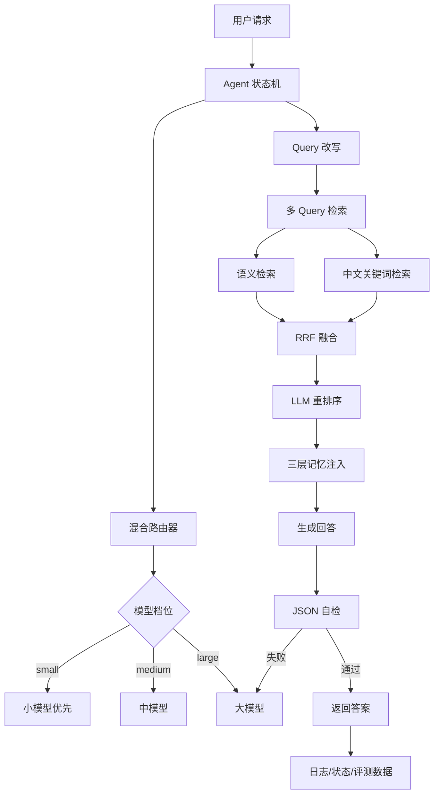

# RAG-Memory-Agent

企业知识库 RAG + 三层记忆 AI 助理，集成大模型路由、级联升级、Agent 状态机、RAGAS 评测和 LLM-as-Judge。

[English README](README.md) · [完整实验报告](outputs/routing_benchmark_report.md)

## 项目亮点

- 企业知识库 RAG：文档上传、标题感知分块、Embedding 入库、混合检索、RRF 融合、LLM 重排序、基于上下文回答
- 三层记忆：短期会话窗口、长期记忆向量召回、用户偏好抽取与更新
- 多轮上下文检索：原始问题、改写问题、近期用户问题共同参与召回，缓解指代不明
- 大模型路由：规则路由 + 小模型难度评分，自动分配 `small / medium / large` 三档模型
- 级联升级：小模型优先回答，自检不通过自动升级高配模型重生成
- Agent 状态机：显式记录 `route / retrieve / generate / validate / persist / done` 阶段
- 结构化输出约束：路由评分与回答自检使用 JSON 输出，提升解析稳定性
- 自动化评测：RAGAS、LLM-as-Judge、成本/延迟 benchmark、状态机稳定性 benchmark

## 量化结果

### RAG 检索与回答质量

基于 10 万字企业制度模拟知识库、184 个优化后知识分块、30 条测试样本：

| 指标 | 得分 |
|---|---:|
| Context Precision | 0.8072 |
| Context Recall | 0.9000 |
| Faithfulness | 0.8534 |
| Answer Relevancy | 0.8567 |
| Answer Correctness | 0.8867 |

检索优化前后对比：

| 指标 | 优化前 | 优化后 | 提升 |
|---|---:|---:|---:|
| Context Precision | 0.7500 | 0.8072 | +7.63% |
| Context Recall | 0.7833 | 0.9000 | +14.89% |

### 成本与延迟

对比固定使用 `qwen-max` 的 baseline 与三档模型路由方案：

| 指标 | Baseline | Optimized | 改善 |
|---|---:|---:|---:|
| 总成本估算 | 0.007257 | 0.0007871 | 下降 89.15% |
| 平均延迟 | 21620.69 ms | 6454.71 ms | 下降 70.15% |
| P95 延迟 | 41866.45 ms | 18294.86 ms | 下降 56.30% |

### Agent 状态机稳定性

基于 50 条混合样本：

| 指标 | 得分 |
|---|---:|
| 请求成功率 | 100.00% |
| 状态链路完整率 | 100.00% |
| 路由结构化解析成功率 | 100.00% |
| 自检结构化解析成功率 | 100.00% |

## 架构流程



## 快速启动

```bash
cp .env.example .env
docker compose up -d --build
```

访问：

```text
http://localhost:8000/
```

## 接口

- `GET /`：Web UI
- `POST /api/chat`：对话
- `GET /api/models?provider=...`：模型列表
- `POST /api/upload`：上传并索引文档

## 三档模型配置

```env
LLM_PROVIDER=dashscope
LLM_SMALL_MODEL=qwen-turbo
LLM_MEDIUM_MODEL=qwen-plus
LLM_LARGE_MODEL=qwen-max
```

不传 `llm_model` 时，自动启用路由和级联升级；传入 `llm_model` 时，绕过路由，便于调试。

## 评测命令

RAGAS 检索评测：

```bash
docker compose exec -T app python scripts/ragas_eval.py \
  --input data/ragas_enterprise_kb_testset.csv \
  --metric-set retrieval
```

回答端 LLM-as-Judge：

```bash
docker compose exec -T app python scripts/llm_judge_eval.py \
  --input outputs/ragas_enterprise_faithfulness_collected.csv
```

路由成本与延迟：

```bash
docker compose exec -T app python scripts/benchmark_routing.py \
  --input data/ragas_employee_handbook_testset.csv
```

Agent 状态机稳定性：

```bash
docker compose exec -T app python scripts/benchmark_agent_state.py \
  --input data/agent_state_benchmark_questions.csv
```

## 技术栈

Python / FastAPI / LangChain / SQLAlchemy / PostgreSQL / Docker / RAGAS / LLM-as-Judge / OpenAI-compatible API / Qwen（DashScope）
